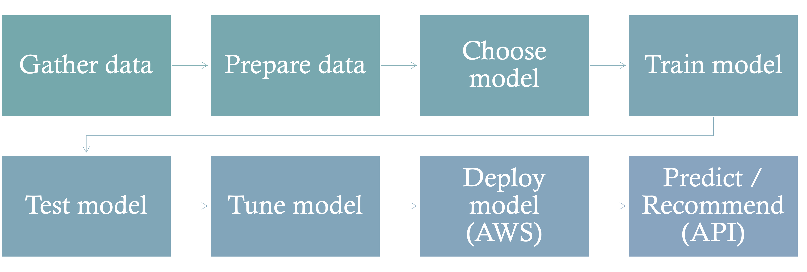
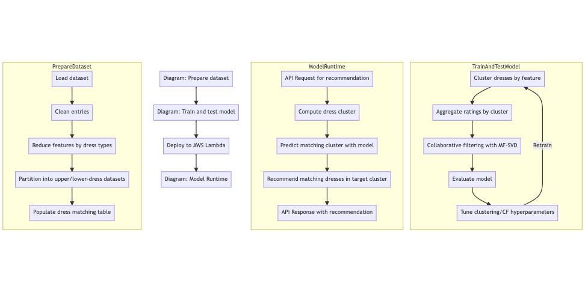
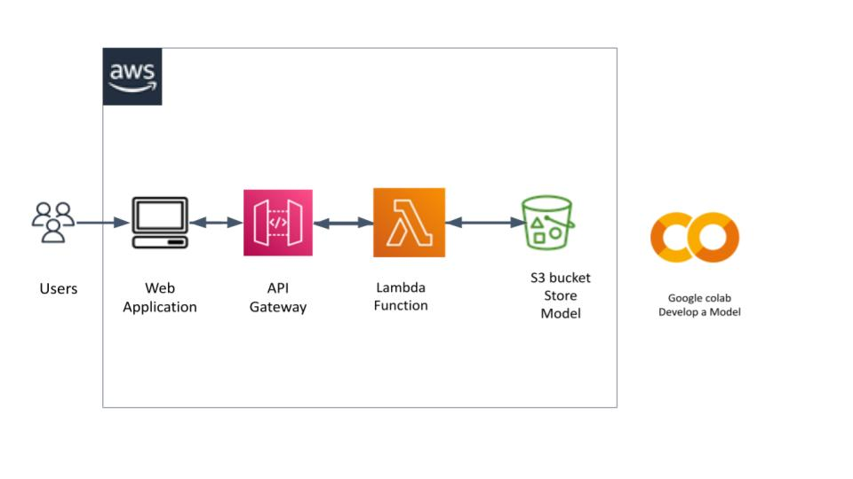

# CMPE295-Masters Project
## University : [San Jose State University](http://www.sjsu.edu/)
## Project: Sustainable Fashion Recommendation Application using Machine Learning
## Advisor: Dr. KaiKai Liu
## Instructor: Prof. Dan Harkey

## Machine Learning process techniques

1. Machine learning typically involves cleaning the datasets; choosing a model; training, evaluating and tuning the model; deploying the model; and recommending in production using the model.
   

## Machine Leaning Algorithm

Data set used: https://liuziwei7.github.io/projects/DeepFashion.html
### Deep fashion data cleaning

1. We start with the DeepFashion dataset with ~1K+ attributes and 280K+ entries, and clean and reduce the dimensionality of the dataset to less than 20 features each for upper and lower-body dress types. We also populate a dataset with ratings between matching upper and lower-body dress types to seed the model. Link to the data cleaning notebook is [here](https://github.com/shreyaghotankar/CMPE295-Masters_Project/blob/master/datacleaning/dataframedeepfashion/AttributesCleaningDeepFashionDataset.ipynb)
   
### Collaborative filtering with K-means clustering

1. Clustering the dataset by the above reduced attributes using K-Means, and creating a matrix of aggregate ratings between upper/lower-body dress types improves  model evaluation results. Link to the notebook is [here](https://github.com/shreyaghotankar/CMPE295-Masters_Project/blob/master/datacleaning/models/CF_final/CollaborativeFiltering.ipynb)

2.  We then apply model-based Collaborative Filtering (CF) with SVD matrix factorization to compute the embeddings necessary to predict ratings between any upper/lower-body dress items.
   
3.  Evaluating the model helps tune the hyperparameters to K-Means and CF and guide re-training the model. We used techniques such as elbow method to effeciently determine the clusters.

4. The trained model is periodically deployed to AWS as a callable API. A request dress type is mapped to its corresponding cluster, matched by the model to its target dress type, and used to recommend matching dresses from the inventory in the response. Link to the code is [here](https://github.com/shreyaghotankar/CMPE295-Masters_Project/blob/master/datacleaning/deployment/attributeconversion.py)
   
   

5. Link to the manually mapped images: [here](https://github.com/shreyaghotankar/CMPE295-Masters_Project/blob/master/datacleaning/manualmapped/automate_manual_mapping.ipynb)

### AWS deployment of machine learning model

## Architecture Diagram for Machine Learning Deployment:
   

    We have developed the model on Google Colaboratory. We have used AWS services for ML Model deployment. Services include - AWS S3, Amazon API Gateway( RESTful API), and AWS Lambda function along with AWS Amplify.
After the development of the model, we pickled the model and uploaded it to S3 bucket. Used Edge optimized API for the endpoint. When we get an event triggered from frontend of the application, Lambda function will load the saved model file from S3 and then the prediction will be returned based on the input.

### Setup for Deployment : [Deployment Steps](https://github.com/shreyaghotankar/CMPE295-Masters_Project/blob/master/datacleaning/deployment/Machine%20Learning%20Setup.docx)

### Lamba Code : [here](https://github.com/shreyaghotankar/CMPE295-Masters_Project/blob/master/datacleaning/deployment/lambda_function.py)

